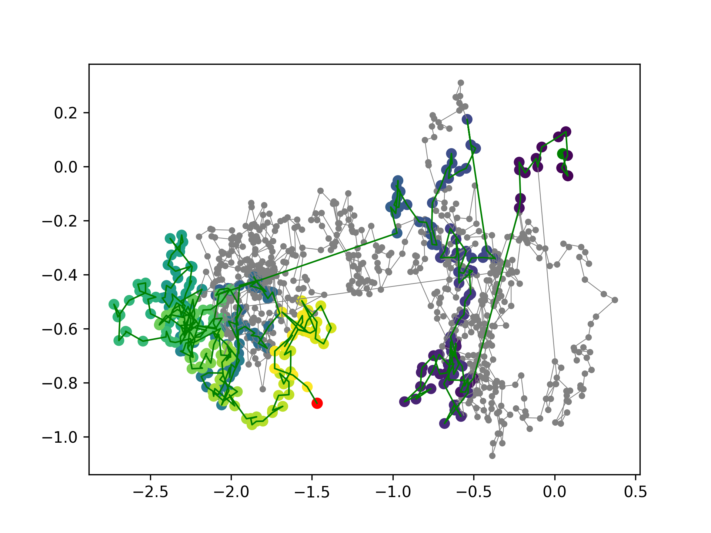
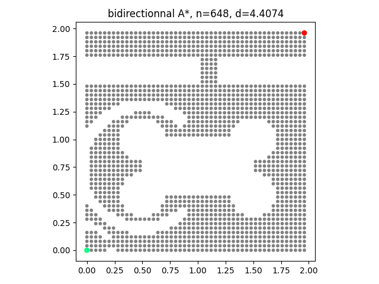
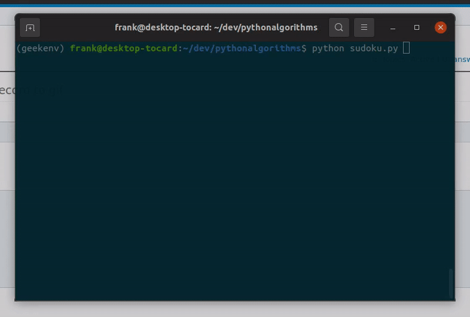
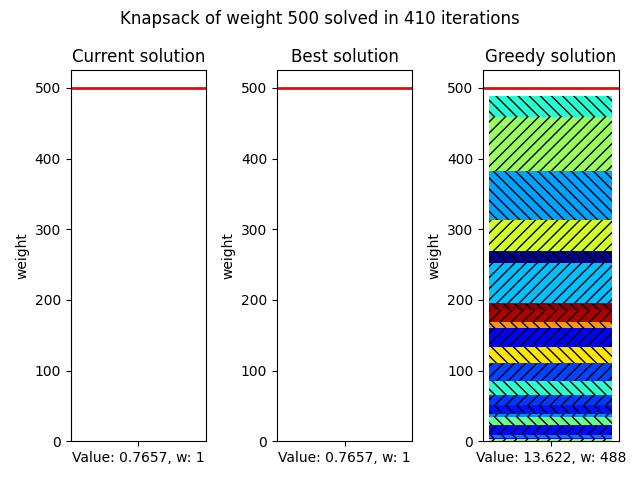

# Implementations of algorithms in python for Fun

This repo implements a variety of algorithms leveraging powerful python features: heapq, dataclasses, `__getitem__`, generators, namedtuple, defaultdict, ...

matplotlib and rich are used to visualize the algorithms step by step.

## Installation

I used **python 3.9.x**.
```
pip install -r requirements.txt
```

## List of algorithms

* Find the minimum number of coins among permitted values to reach a value using dynamic programming: [mini_coin_dynamic.py](https://github.com/colon3ltocard/pythonalgorithms/blob/main/mini_coin_dynamic.py)


* Generate a graph using random walk and random extra connections and find the shortest path using [Dijkstra algorithm.](https://github.com/colon3ltocard/pythonalgorithms/blob/main/dijkstra.py)



* Implement and animate bidirectionnal [Dijkstra and A* algorithms using iterators and heuristics](https://github.com/colon3ltocard/pythonalgorithms/blob/main/bidir_dijkstra.py)


* Generate a [grid with obstacles](https://github.com/colon3ltocard/pythonalgorithms/blob/main/grid_dijkstra.py) and animate [bidir Dijkstra versus bidir A* versus fast but inconsistent bidir A*](https://github.com/colon3ltocard/pythonalgorithms/blob/main/astar_grid.py)





* Generate a [sudoku using backtracking and animate using rich](https://github.com/colon3ltocard/pythonalgorithms/blob/main/sudoku.py)


* Generate and solve a [knapsack problem using branch and bound](https://github.com/colon3ltocard/pythonalgorithms/blob/main/knapsack.py)

